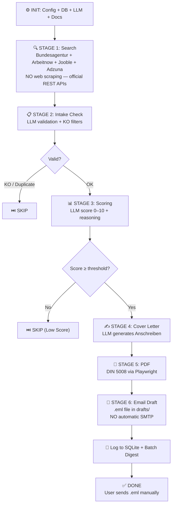

# AI-JobFinder

**🚨 RECHTLICHER HINWEIS — Dieses Tool interagiert automatisiert mit Webseiten Dritter, was gegen deren AGB oder geltende Datenschutzgesetze (u.a. DSGVO, TTDSG) verstoßen kann. Die Nutzung erfolgt ausschließlich zu Test- und Lernzwecken. Nicht für reale Bewerbungen verwenden. Geplant sind eine Umstellung auf offizielle APIs sowie die Nutzung lokaler LLMs, um Rechtskonformität zu gewährleisten.**

**⚠️ BETA — This project is in early beta. Features, configuration, and data formats may change without notice. Use at your own risk.**

**⚠️ LEGAL COMPLIANCE NOTICE — This project is designed to operate FULLY LOCALLY to comply with EU/German data protection law (GDPR, BDSG, EU AI Act).** See `LEGAL_COMPLIANCE_PLAN.md` for the complete compliance strategy.

AI-assisted job application tool for the German-speaking market. Searches official job APIs (Bundesagentur für Arbeit, Arbeitnow), evaluates vacancies through local LLM scoring (Ollama), generates personalised cover letters as PDF, and creates email drafts for manual user review. **No automatic emails, no cloud LLM for PII, no session-based scraping.**

---

## 🔑 API Keys — Quick Overview

| Service | Usage | GDPR Safe? |
|---------|-------|------------|
| **Ollama** (default LLM) | Local scoring, cover letters, CV parsing — **no data leaves your machine** | ✅ Fully local |
| **Jooble API** (job source) | Job search aggregator REST API — covers Germany with free tier | ✅ Local API call only |
| **Adzuna API** (job source) | Global job search REST API with Germany coverage — free tier | ✅ Local API call only |
| **Gemini** (optional fallback) | Fallback LLM when local model unavailable | ❌ PII sent to US |
| **OpenRouter** (optional fallback) | Free fallback LLM | ❌ PII sent to US |

> **Default: `llm.priority: local`** — All PII stays on your machine. Cloud LLMs are disabled unless explicitly enabled.

---

## 🚀 Open Source — Fork & Improve

**This project lives from the community!**  
Whether you are an experienced Python developer, an AI enthusiast, or just someone who wants to automate the job application process — **you are warmly invited to fork this repository, improve it, or extend it**.

Roadmap:
- ➕ **More job APIs** — StepStone, Xing
- ➕ **More local LLMs** — via Ollama model library
- ➕ **Docker containerization** — one-command setup
- ➕ **Web UI / Dashboard** — track applications visually

→ **Fork the repository**, create a Pull Request, or open an Issue.  
→ **Every contribution counts** — be it a new module, a bug fix, or better documentation.

---

## Table of Contents

- [Legal Compliance](#-legal-compliance)
- [How It Works](#how-it-works)
- [Requirements](#requirements)
- [Installation](#installation)
- [Configuration](#configuration)
- [CLI Arguments](#cli-arguments)
- [Architecture](#architecture)

---

## ⚖️ Legal Compliance

This project is designed to AVOID the following legal violations:

| Risk | Mitigation |
|------|------------|
| **GDPR Art. 22** — Automated profiling decisions | Scoring is a **recommendation**. User makes final decision. All outputs are drafts. |
| **GDPR Art. 5-6** — Processing recruiter data without consent | **No automatic emails.** `.eml` drafts generated for manual sending only. |
| **Schrems II** — PII transfer to US cloud providers | **Default LLM is local** (Ollama). Cloud LLMs are optional opt-in fallbacks. |
| **ToS violations** — Web scraping job portals | **Official job APIs** (Bundesagentur, Arbeitnow) instead of scraping. |
| **UrhG database rights** — Bulk content extraction | API-based data access respects copyright. |
| **EU AI Act** — High-risk AI in hiring | Human-in-the-loop design. All decisions reviewed by user. |

**Full plan:** See `LEGAL_COMPLIANCE_PLAN.md`
**Implementation rules:** See `AGENTS.md` → Legal Compliance Requirements

---

## How It Works

AI-JobFinder operates in **two modes** — Legacy (web scraping + SMTP) and Pipeline (GDPR-compliant). This document describes the **Pipeline mode**, which is the recommended path.

### Pipeline Mode — 6 Stages

The `JobPipeline` orchestrator in `src/job_agent/pipeline.py` processes each job through 6 clean stages:

**Stage 0 — Initialization**
- Load `config.yaml` (API keys, SMTP, Chrome path)
- Load `job_criteria.yaml` (KO filters, min score, industry rules)
- Load `candidate_profile.json` (CV data: skills, experience, education)
- Load `prompts.yaml` (LLM prompt templates)
- `init_db()` → SQLite `output/applications.db` (3 tables)
- `init_gemini()` + `ollama_available()` → LLM client cascade ready
- `index_candidate_files()` → scan `documents/*.pdf` into DB

**Stage 1 — Job Search (Official APIs, NO web scraping)**
- `search_all_sources(query, location, radius)` from `job_sources/`
- **Bundesagentur für Arbeit** — API v6: `POST https://rest.arbeitsagentur.de/jobboerse/jobsuche-service/pc/v6/jobs` with public `X-API-Key: jobboerse-jobsuche` header. Returns JSON with `ergebnisliste`.
- **Arbeitnow** — free API: `GET https://www.arbeitnow.com/api/job-board/api`. No authentication.
- **Jooble** — free aggregator API: `POST https://jooble.org/api/{key}`. Requires `JOOBLE_API_KEY` env var. Returns jobs from multiple job boards via a single endpoint.
- **Adzuna** — free global job API: `GET https://api.adzuna.com/v1/api/jobs/de/search`. Requires `ADZUNA_APP_ID` and `ADZUNA_APP_KEY` env vars. Provides salary data, company info, and direct apply URLs.
- Deduplication by URL, sorted, limited to `max_results` (~25)
- Returns `list[JobPosting]` dataclass (url, title, company, description, salary, location, source)

**Stage 2 — Intake Check (LLM validation)**
- `pipeline.job_intake(job)` → LLM prompt: `job_intake_prompt`
- Validates: is_valid_job (not spam/test), company_name, job_title, industry (IT/Handwerk/Chemie/Finanzen/...)
- Detects: forbidden titles (Senior/Junior mismatch via word boundary), duplicate in DB (URL + company+title match)
- KO triggers: company blacklist, clearance keywords, certifications, language requirements, salary threshold, spam providers, datacenter/physical work
- Fallback: `_default_intake()` allows the job through if LLM fails

**Stage 3 — Scoring (LLM match evaluation)**
- `pipeline.score_job(job, intake)` → LLM prompt: `scoring_prompt_{industry}`
- Returns: `total_score` (0.0–10.0), `ko_criterion_triggered`, `reasoning` (German text)
- Factors: industry-specific KO rules, mandatory skills, career_start_year, salary, language levels, clearance, past rejection reasons
- Threshold: `min_score_to_apply` from `job_criteria.yaml` → `industries.{industry}.scoring` (default 8.0)
- Below threshold → skip. KO triggered → skip.

**Stage 4 — Cover Letter (LLM generation)**
- `pipeline.generate_anschreiben(job, intake, score_data)` → LLM prompt: `cover_letter_prompt_{industry}`
- Returns: `subject`, `salutation` (with name if known), `body` (3–5 paragraphs, DIN 5008), `closing`, `full_text`
- Context: CV text from `documents/*.pdf`, industry-specific mandatory skills, salary expectation, availability
- Fallback: `_empty_anschreiben()` returns a minimal template if LLM fails

**Stage 5 — PDF Rendering (DIN 5008 via Playwright)**
- `pipeline.save_pdf(anschreiben_data, company_name)`
- HTML → Chromium headless → `page.pdf()`
- Format: A4, 25mm/20mm margins, sender block (right-aligned), recipient, date, subject, salutation, body, closing
- Saved: `src/output/Anschreiben_{CompanyName}.pdf`

**Stage 6 — Email Draft (.eml, NO SMTP — GDPR compliant)**
- `pipeline.create_draft(job, anschreiben, pdf_path)`
- `extract_contact_info(job.description)` → finds recruiter email if present in job text
- `personalize_anschreiben()` → inserts recruiter name into salutation if known
- `_collect_candidate_docs()` → collects CV + certificates from DB as attachments
- `generate_email_draft()` → writes `.eml` file to `drafts/` directory
- CC copy also generated for the candidate (if candidate email is configured)
- ⚠️ **Drafts must be opened manually** in a mail client (Thunderbird, Outlook) — no automatic sending

**Final — Logging + Batch Digest**
- `log_application()` → SQLite `applied_jobs` (status, score, pdf_path)
- `generate_pending_digest()` → `drafts/digest_{date}.eml` with all pending applications
- Summary printed: Approved / Skipped / Total

### LLM Cascade (Priority)

```
llm_request_with_fallback(prompt)
  │
  ├── 1. LOCAL (Ollama)
  │   ├── ollama_available("llama3.2:3b")?
  │   ├── YES → call_ollama(prompt, model)
  │   │   POST http://localhost:11434/api/generate
  │   └── NO / Error → fallback to OpenRouter
  │
  ├── 2. OPENROUTER (free tier)
  │   ├── call_openrouter(prompt)
  │   └── Error → fallback to Gemini
  │
  └── 3. GEMINI (Google Cloud — last resort)
      ├── Key rotation (up to 5 API keys)
      ├── Models: gemini-2.5-flash → 3.1-flash-lite → 2.5-flash-lite → flash-latest
      └── All exhausted → user prompt for new key or wait
```

### GDPR Compliance Map

| Legal Risk | Mitigation | Status |
|-----------|-----------|--------|
| Web scraping ToS violations | Official APIs (Bundesagentur + Arbeitnow + Jooble + Adzuna) | ✅ |
| Automated profiling (GDPR Art. 22) | Human-in-the-loop: user reviews all scores | ✅ |
| PII transfer to US (Schrems II) | Default LLM is local (Ollama), cloud is opt-in fallback | ✅ |
| Unauthorized recruiter outreach | `.eml` drafts only — manual sending required | ✅ |
| Bulk data extraction (UrhG) | API-based access respects copyright | ✅ |
| High-risk AI in hiring (EU AI Act) | All decisions reviewed by user; scoring is a recommendation | ✅ |

---

## Pipeline Diagram

The diagram below shows the **GDPR-compliant Pipeline mode**. Legacy mode (web scraping + SMTP) is available via `agent.py` without `--pipeline` but is not recommended.



## Requirements

### Python

- **Version**: 3.10 or higher (tested with 3.11, 3.12).
- **Architecture**: x64 recommended. ARM (Windows ARM) may have Playwright compatibility issues.

### SQLite

- **Bundled with Python**: No separate installation needed. SQLite is part of the Python standard library (`sqlite3` module).
- **Database file**: Created automatically at `output/applications.db` on first run.
- **Schema**: Two tables — `applied_jobs` (application history) and `user_rejections` (user-cancelled applications with reasons). Schema is auto-created by `init_db()`.

### Operating System

- **Cross-platform**: Runs on Windows, Linux, and macOS. Set `chrome_data_dir` in `config.yaml` to match your OS (see sample file for examples).
- **Windows**: Tested on Windows 11. Use `.\check_types.ps1` for type checking.
- **Linux**: Tested on Gentoo Linux. Use `bash check_types.sh` for type checking.
- **PowerShell**: Used for coloured terminal output on Windows. On Linux/macOS, ANSI escape codes work natively.

### Chrome / Chromium

- **Required for**: Playwright web scraping and form filling.
- **Installation options**:
  1. Existing Chrome installation (point `config.yaml` → `user_profile.chrome_data_dir` to your profile).
  2. Playwright's bundled Chromium (auto-downloaded by `playwright install chromium`).

### Disk Space

- **Minimum**: ~500 MB for Playwright Chromium browser.
- **Runtime**: ~50 MB for generated PDFs, ZIP archives, and the SQLite database.

---

## Installation

### 1. Install Python packages

```powershell
python -m pip install google-genai playwright pyyaml pymupdf reportlab
```

> **Note**: `reportlab` is required for PDF generation. `pymupdf` (fitz) is used for PDF text extraction during document indexing. If `pip install` is blocked by Windows Defender, use `python -m pip install` instead of bare `pip`.

### 2. Install Playwright Chromium

```powershell
python -m playwright install chromium
```

This downloads ~300 MB of browser binaries to `%USERPROFILE%\AppData\Local\ms-playwright`.

### 3. Verify installation

```powershell
python -c "import sqlite3; print('SQLite', sqlite3.sqlite_version); from google import genai; print('Gemini SDK OK'); import playwright; print('Playwright OK')"
```

### 4. Prepare your documents

After extracting the archive, your project should look like this:

```
AI-JobFinder/
├── README.md
├── .gitignore
├── requirements.txt
├── src/
│   ├── agent.py
│   ├── config/
│   │   ├── config.yaml.sample       ← rename to config.yaml
│   │   ├── job_criteria.yaml.sample
│   │   └── candidate_profile.json.sample
│   └── ...
└── documents/                       ← place your PDF files here
    └── .gitkeep
```

**Steps:**

1. **Create the `documents/` folder** (if not already present) — it is a sibling of `src/`.
2. **Copy your CV** into `documents/` — e.g. `documents/Lebenslauf_YourName.pdf`.
3. **Add certificates, diplomas, recommendation letters** — all PDFs in `documents/` will be automatically indexed by the agent (classified by filename and content).
4. **Rename the config files** — copy `src/config/config.yaml.sample` → `src/config/config.yaml`, and optionally customise `job_criteria.yaml.sample` and `candidate_profile.json.sample`.
5. **Edit `config.yaml`** — set `cv_path` and `documents_dir` to match your folder structure:

```yaml
user_profile:
  cv_path: "../documents/Lebenslauf_YourName.pdf"   # relative to src/
  documents_dir: "../documents"                      # relative to src/
```

> The paths are relative to the `src/` directory because `agent.py` runs from there. Absolute paths also work.

---

## Configuration

### API Keys

#### Gemini API Key (primary LLM)

| Item | Detail |
|------|--------|
| **Where to get** | https://aistudio.google.com/apikey |
| **Cost** | Free tier: 60 requests per minute, 1,500 requests per day on `gemini-2.5-flash` |
| **What it's used for** | Scoring jobs, generating cover letters, extracting recruiter names, classifying documents, parsing CVs |
| **How many** | Up to 5 keys in `config.yaml` → `gemini.api_keys`. The agent rotates through them automatically on 429/ResourceExhausted. Multiple keys extend your daily quota. |

#### OpenRouter API Key (free fallback LLM)

| Item | Detail |
|------|--------|
| **Where to get** | https://openrouter.ai/keys (sign up, create a free API key) |
| **Cost** | Free tier: 20 RPM, 50 RPD, multiple models (Llama 3, Mistral, Qwen, DeepSeek, Gemma) |
| **What it's used for** | Automatic fallback when ALL Gemini keys and models are exhausted |
| **How to set** | Environment variable `OPENROUTER_API_KEY` (preferred) or in `config.yaml` → `openrouter.api_key`. See [Setting Environment Variables](#setting-environment-variables) below. |
| **Custom model** | Optional: set `OPENROUTER_MODEL` env var to override the default free model |

#### SMTP / Google App Password

| Item | Detail |
|------|--------|
| **Where to get** | https://myaccount.google.com/apppasswords |
| **Prerequisites** | Google Account with 2-Factor Authentication enabled |
| **What it's used for** | Sending application emails (direct email to recruiter, CC copy to candidate, pending batch emails) |
| **How to generate** | Go to App Passwords → Select app "Mail" → Select device "Windows Computer" → Copy the 16-character password |
| **SMTP settings** | Host: `smtp.gmail.com`, Port: `587` (STARTTLS, fallback to 465 SSL), Username: your full Gmail address, Password: the 16-char App Password |
| **Security** | The App Password grants email-only access. It can be revoked at any time from the same page. Never use your regular Gmail password. |

#### DeepSeek API Key (optional, experimental)

| Item | Detail |
|------|--------|
| **Where to get** | https://platform.deepseek.com/api_keys |
| **Cost** | Paid (requires account balance top-up). Free credits on registration. |
| **How to set** | Environment variables: `DEEPSEEK_API_KEY` or `DEEPSEEK_KEY`. Custom model via `DEEPSEEK_MODEL`. |
| **Usage** | Experimental module `job_agent/deepseek_llm.py`. Not used unless explicitly configured. |

#### Groq API Key (optional, experimental)

| Item | Detail |
|------|--------|
| **Where to get** | https://console.groq.com/keys |
| **Cost** | Free tier available (rate-limited). |
| **How to set** | Environment variables: `GROQ_API_KEY` or `GROQ_KEY`. Custom model via `GROQ_MODEL`. |
| **Usage** | Experimental module `job_agent/groq_llm.py`. Not used unless explicitly configured. |

#### Jooble API Key (job source — free tier)

| Item | Detail |
|------|--------|
| **Where to get** | https://jooble.org/api |
| **Cost** | Free tier available (rate-limited). Register for a publisher account to receive your API key. |
| **What it's used for** | Searching job listings in Germany via Jooble's job aggregator REST API (`POST https://jooble.org/api/{key}`). Returns structured job data: title, company, location, salary, description, direct link. |
| **How to set** | Environment variable `JOOBLE_API_KEY` (preferred). See [Setting Environment Variables](#setting-environment-variables) below. |
| **GDPR** | ✅ Safe — only API calls (keyword + location) sent to Jooble server. No PII transmitted. |

#### Adzuna API Key (job source — free tier)

| Item | Detail |
|------|--------|
| **Where to get** | https://developer.adzuna.com/ |
| **Cost** | Free tier available (rate-limited). Register to receive your `app_id` and `api_key`. |
| **What it's used for** | Searching job listings in Germany via the Adzuna API (`GET https://api.adzuna.com/v1/api/jobs/de/search`). Returns job titles, companies, locations, salary ranges, descriptions, and redirect URLs. |
| **How to set** | Two environment variables: `ADZUNA_APP_ID` and `ADZUNA_APP_KEY`. See [Setting Environment Variables](#setting-environment-variables) below. |
| **GDPR** | ✅ Safe — only API calls (keyword + location) sent to Adzuna server. No PII transmitted. |

---

### Setting Environment Variables

Some API keys (OpenRouter, DeepSeek, Groq) are read from **environment variables** so they never appear in config files. Environment variables must be set **before** running the agent or added **globally** to persist across reboots.

> ⚠️ Environment variables set in a terminal window only live for that session. To make them permanent, use the global methods below.

#### Required Variables

| Variable | Service | Priority | Example |
|----------|---------|----------|---------|
| `JOOBLE_API_KEY` | Jooble | 🟡 Optional (recommended) | `xxxxxxxxxxxxxxxxxxxxxxxxxxxx` |
| `ADZUNA_APP_ID` | Adzuna | 🟡 Optional (recommended) | `xxxxxxxx` |
| `ADZUNA_APP_KEY` | Adzuna | 🟡 Optional (recommended) | `xxxxxxxxxxxxxxxxxxxxxxxxxxxxxxxx` |
| `OPENROUTER_API_KEY` | OpenRouter | 🟡 Optional (fallback LLM) | `sk-or-v1-xxxxxxxxxxxxxxxxxxxxxxxxxxxxxxxxxxxxxxxxxxxx` |
| `OPENROUTER_MODEL` | OpenRouter model | 🟢 Optional | `openai/gpt-oss-120b:free` |
| `DEEPSEEK_API_KEY` | DeepSeek | 🟢 Optional | `sk-xxxxxxxxxxxxxxxxxxxxxxxxxxxxxxxx` |
| `DEEPSEEK_MODEL` | DeepSeek model | 🟢 Optional | `deepseek-v4-flash` |
| `GROQ_API_KEY` | Groq | 🟢 Optional | `gsk_xxxxxxxxxxxxxxxxxxxxxxxxxxxxxxxx` |
| `GROQ_MODEL` | Groq model | 🟢 Optional | `llama-3.3-70b-versatile` |

> **Jooble** and **Adzuna** are job search API sources — they increase the number of jobs found per search. If not configured, the pipeline simply skips them with a yellow warning (graceful degradation).

> **Note:** Gemini API keys are stored in `config.yaml` (not environment variables) — they are read directly from the config file.

#### Windows

##### Method 1: System-wide (GUI)

1. Press **Win + R**, type `sysdm.cpl`, press Enter
2. Go to tab **Advanced** → button **Environment Variables…**
3. Under **User variables** (or System variables for all users), click **New…**
4. Variable name: `OPENROUTER_API_KEY`
5. Variable value: `sk-or-v1-xxxxxxxxxxxxx`
6. Click OK → OK → OK
7. **Restart** any open terminal windows for changes to take effect

##### Method 2: PowerShell (permanent, current user)

```powershell
[System.Environment]::SetEnvironmentVariable('JOOBLE_API_KEY', 'xxxxxxxxxxxxxxxxxxxxxxxxxxxx', 'User')
[System.Environment]::SetEnvironmentVariable('ADZUNA_APP_ID', 'xxxxxxxx', 'User')
[System.Environment]::SetEnvironmentVariable('ADZUNA_APP_KEY', 'xxxxxxxxxxxxxxxxxxxxxxxxxxxxxxxx', 'User')
[System.Environment]::SetEnvironmentVariable('OPENROUTER_API_KEY', 'sk-or-v1-xxxxxxxxxxxxx', 'User')
[System.Environment]::SetEnvironmentVariable('OPENROUTER_MODEL', 'openai/gpt-oss-120b:free', 'User')
```

> Replace `'User'` with `'Machine'` for system-wide (requires Admin).

##### Method 3: Command Prompt (permanent, current user)

```cmd
setx JOOBLE_API_KEY "xxxxxxxxxxxxxxxxxxxxxxxxxxxx"
setx ADZUNA_APP_ID "xxxxxxxx"
setx ADZUNA_APP_KEY "xxxxxxxxxxxxxxxxxxxxxxxxxxxxxxxx"
setx OPENROUTER_API_KEY "sk-or-v1-xxxxxxxxxxxxx"
setx OPENROUTER_MODEL "openai/gpt-oss-120b:free"
```

##### Verify (Windows)

```powershell
# PowerShell
$env:OPENROUTER_API_KEY
```
```cmd
:: Command Prompt
echo %OPENROUTER_API_KEY%
```

#### Linux / macOS

##### Method 1: Shell profile (recommended — persists across reboots)

Add to `~/.bashrc` (Bash) or `~/.zshrc` (Zsh):

```bash
# OpenRouter — free LLM fallback
export OPENROUTER_API_KEY="sk-or-v1-xxxxxxxxxxxxx"
export OPENROUTER_MODEL="openai/gpt-oss-120b:free"

# Job sources — Jooble (recommended)
export JOOBLE_API_KEY="xxxxxxxxxxxxxxxxxxxxxxxxxxxx"

# Job sources — Adzuna (recommended)
export ADZUNA_APP_ID="xxxxxxxx"
export ADZUNA_APP_KEY="xxxxxxxxxxxxxxxxxxxxxxxxxxxxxxxx"

# Optional: DeepSeek
export DEEPSEEK_API_KEY="sk-xxxxxxxxxxxxxxxxxxxxxxxxxxxxxxxx"

# Optional: Groq
export GROQ_API_KEY="gsk_xxxxxxxxxxxxxxxxxxxxxxxxxxxxxxxx"
```

Then reload:

```bash
source ~/.bashrc   # or: source ~/.zshrc
```

##### Method 2: System-wide (all users)

Add to `/etc/environment` (no `export` keyword, requires `sudo`):

```bash
sudo nano /etc/environment
```

```
OPENROUTER_API_KEY="sk-or-v1-xxxxxxxxxxxxx"
OPENROUTER_MODEL="openai/gpt-oss-120b:free"
```

Reboot or run `source /etc/environment` to apply.

##### Method 3: Systemd user service (advanced)

For users who run the agent as a systemd service:

```bash
mkdir -p ~/.config/environment.d
echo 'OPENROUTER_API_KEY=sk-or-v1-xxxxxxxxxxxxx' >> ~/.config/environment.d/ai-jobfinder.conf
```

##### Verify (Linux / macOS)

```bash
echo $OPENROUTER_API_KEY
# or
printenv OPENROUTER_API_KEY
```

### Configuration Files

All configuration files are in `config/`. Sample files (with `.sample` extension) serve as templates. On first run, if an active config file is missing, the agent automatically copies the `.sample` file and prints a warning.

#### `config/config.yaml` — Master configuration

```yaml
gemini:
  model: gemini-2.5-flash
  api_keys:
    - "YOUR_API_KEY_1"
    - "YOUR_API_KEY_2"

user_profile:
  chrome_data_dir: "C:\\Users\\YourName\\AppData\\Local\\Google\\Chrome\\User Data"
  chrome_profile: Default
  cv_path: "Lebenslauf_YourName.pdf"
  documents_dir: "documents"

smtp:
  host: smtp.gmail.com
  port: 587
  username: "your.email@gmail.com"
  password: "xxxx xxxx xxxx xxxx"   # Google App Password

defaults:
  availability: "zwei Monate nach Zusage"
  notice_period: "3 Monate zum Quartalsende"
  salary_expectation: "36.000 €"
  work_permit: Germany

criteria:
  excluded_companies: ["CompanyToSkip"]
  german_level: B2
  min_salary_eur: 36000
  min_score: 8.0
  remote_allowed: true

llm:
  priority: gemini   # "gemini" or "openrouter" — which LLM to try first
```

> **Security**: This file contains API keys and SMTP password. It is listed in `.gitignore` and must NEVER be committed.

#### `config/candidate_profile.json` — Your professional profile

```json
{
  "personal_info": {
    "first_name": "Max",
    "last_name": "Mustermann",
    "email": "max.mustermann@gmail.com",
    "phone": "+49 176 12345678",
    "address": "Musterstr. 1, 12345 Berlin",
    "linkedin": "https://linkedin.com/in/maxmustermann",
    "github": "https://github.com/maxmustermann",
    "birth_date": "1990-01-01",
    "nationality": "Deutsch"
  },
  "education": [...],
  "experience": [...],
  "skills": ["Linux", "Python", "Java"],
  "certifications": [...],
  "languages": {"Deutsch": "C2", "Englisch": "B2", "Russisch": "Muttersprache"},
  "salary_expectation": "36.000 €",
  "availability": "zwei Monate nach Zusage",
  "notice_period": "3 Monate zum Quartalsende",
  "work_permit": "Germany",
  "career_start_year": 2010
}
```

#### `config/job_criteria.yaml` — KO filters and scoring rules

Defines `ko_filters` (blocking criteria), `scoring` (minimum score), and `cover_letter` (mandatory skills to mention). See the sample file for the full schema.

#### `config/prompts.yaml` — LLM prompt templates

Customise prompts for:
- `scoring_prompt` — how the LLM evaluates job fit
- `cover_letter_prompt` — how the Anschreiben is written
- `form_filler_prompt` — how Playwright fills web form fields
- `classification_prompt` — how documents are classified
- `extract_recruiter_prompt` — how recruiter names are extracted from job text

**Important**: The `form_filler_prompt` must return a JSON array of `{action, selector_type, selector_value, value}`. This format is critical for Playwright to parse and execute form actions.

---

## CLI Arguments

### Overview

```powershell
python agent.py [--search-jobs QUERY] [--location CITY] [--radius KM]
                [--pipeline] [--send-email] [--parse-cv] [--test-score FILE]
                [--test-anschreiben COMPANY FILE] [--generate-dummy-cv]
                [--reset-candidate] [--no-cloud-llm] [--cloud-only]
                [--ignore-ollama] [--gui]
```

### Argument Reference

#### `--search-jobs [QUERY]`

Searches Indeed for job vacancies matching the keyword, scrapes all result pages, and processes each link through the full pipeline.

| Aspect | Detail |
|--------|--------|
| **Syntax** | `--search-jobs "Junior Systemadministrator"` or `--search-jobs ""` (empty = any job) |
| **Works with** | `--location`, `--radius`, `--headless`, `--auto-approve`, `--send-email` |
| **Conflicts with** | `--url`, `--interactive`, `--parse-cv`, `--test-score`, `--test-anschreiben`, `--generate-dummy-cv`, `--reset-candidate` |
| **Behaviour** | Opens Indeed → types query → clicks search → extracts all job links from result pages → visits each link → runs full pipeline |
| **Note** | The `nargs="?"` allows omitting the value: `--search-jobs` with no argument searches for any job. |

#### `--location CITY`

City or region to search in. Used together with `--search-jobs`.

| Aspect | Detail |
|--------|--------|
| **Syntax** | `--location "Frankfurt am Main"` |
| **Requires** | `--search-jobs` |
| **Conflicts with** | `--url`, `--interactive`, `--parse-cv`, `--test-score`, `--test-anschreiben`, `--generate-dummy-cv`, `--reset-candidate` |
| **Default** | If omitted, Indeed searches without location filter. |

#### `--radius KM`

Search radius around the location.

| Aspect | Detail |
|--------|--------|
| **Syntax** | `--radius 25` |
| **Requires** | `--search-jobs` + `--location` |
| **Conflicts with** | Same as `--location` |

#### `--url URL`

Process a single job vacancy by URL.

| Aspect | Detail |
|--------|--------|
| **Syntax** | `--url "https://de.indeed.com/viewjob?jk=XXXXX"` |
| **Works with** | `--headless`, `--auto-approve`, `--send-email` |
| **Conflicts with** | `--search-jobs`, `--interactive`, `--parse-cv`, `--test-score`, `--test-anschreiben`, `--generate-dummy-cv`, `--reset-candidate` |
| **Supports** | Indeed, LinkedIn, StepStone, Monster, and any other job board (Playwright loads the page regardless of source) |
| **Note** | The URL is processed through the full pipeline from step 2 onwards (no search step). |

#### `--interactive`

Prompts the user to paste a URL interactively.

| Aspect | Detail |
|--------|--------|
| **Syntax** | `--interactive` |
| **Works with** | `--headless`, `--auto-approve`, `--send-email` |
| **Conflicts with** | `--search-jobs`, `--url`, `--parse-cv`, `--test-score`, `--test-anschreiben`, `--generate-dummy-cv`, `--reset-candidate` |
| **Behaviour** | Prints `Paste the job URL and press Enter:` → waits for input → processes the URL through the full pipeline → loops asking for the next URL (type `exit` to stop) |

#### `--headless`

Runs Chrome in headless mode (no visible browser window). Automatically enables `--auto-approve`.

| Aspect | Detail |
|--------|--------|
| **Syntax** | `--headless` |
| **Works with** | `--search-jobs`, `--url`, `--interactive`, `--send-email` |
| **Conflicts with** | `--parse-cv`, `--test-score`, `--test-anschreiben`, `--generate-dummy-cv`, `--reset-candidate` |
| **Behaviour** | Launches a separate Chrome instance with a `_Debug` profile on port 9222. The user's main Chrome stays open (required for pre-authenticated sessions on LinkedIn, captcha handling, etc.). The `--headless` flag implies `--auto-approve` (no GUI, no interactive prompts). |
| **Note** | Headless Chrome has limited support for some web features. If a job page renders differently in headless mode, the form filler may behave differently. |

#### `--auto-approve`

Automatically logs all applications without waiting for user confirmation.

| Aspect | Detail |
|--------|--------|
| **Syntax** | `--auto-approve` |
| **Works with** | `--search-jobs`, `--url`, `--interactive`, `--send-email` |
| **Conflicts with** | `--parse-cv`, `--test-score`, `--test-anschreiben`, `--generate-dummy-cv`, `--reset-candidate` |
| **Behaviour** | The human-in-the-loop step is skipped — the application is logged as `Applied` automatically. This flag also implies `--send-email` (pending emails are sent automatically at the end of the pipeline). |
| **Note** | Use carefully — applications are submitted without review. The score and reasoning are still printed to the console for audit. |

#### `--send-email`

Sends all pending application emails to the candidate via SMTP (per-job) and generates a digest `.eml` draft.

| Aspect | Detail |
|--------|--------|
| **Syntax** | `--send-email` (standalone) or with other flags |
| **Works with** | `--pipeline`, `--search-jobs` |
| **Conflicts with** | `--parse-cv`, `--test-score`, `--test-anschreiben`, `--generate-dummy-cv`, `--reset-candidate` |
| **Behaviour** | Sends per-job SMTP to candidate's own email (GDPR Art. 6(1)(f) legitimate interest). Also generates digest `.eml` draft for backup. When used standalone (without `--pipeline`), iterates pending DB jobs. |
| **Note** | No SMTP to recruiters — only `.eml` drafts for manual forwarding. |

#### `--no-cloud-llm`

Forbids all remote LLM calls — uses local Ollama/llama-server only.

| Aspect | Detail |
|--------|--------|
| **Syntax** | `--no-cloud-llm` |
| **Works with** | All flags |
| **Conflicts with** | `--cloud-only` |
| **Behaviour** | Sets `llm.NO_CLOUD_LLM = True` at runtime, overriding config. With `llm.priority: local` this is the default; the flag is an extra safety lock. |

#### `--cloud-only`

Skips local LLM entirely — uses OpenRouter → Gemini only.

| Aspect | Detail |
|--------|--------|
| **Syntax** | `--cloud-only` |
| **Works with** | All flags |
| **Conflicts with** | `--no-cloud-llm` |
| **Behaviour** | Sets `llm.CLOUD_ONLY = True` at runtime. Useful when local models are too slow for testing. With this flag, `llama3.2:3b-hr-assistant` is never used. |

#### `--ignore-ollama`

Proceed even if Ollama/llama-server is not running (demo/testing only).

| Aspect | Detail |
|--------|--------|
| **Syntax** | `--ignore-ollama` |
| **Works with** | All flags |
| **Behaviour** | Skips the local LLM availability check. LLM calls will fail at call time if no local model is running. |

#### `--parse-cv`

Parses and indexes the candidate's CV PDF without running the job pipeline.

| Aspect | Detail |
|--------|--------|
| **Syntax** | `--parse-cv` |
| **Works with** | Nothing (standalone only) |
| **Conflicts with** | Everything else |
| **Behaviour** | Opens the PDF specified in `config.yaml` → `user_profile.cv_path`, extracts text via PyMuPDF, sends it to Gemini for parsing (acts as a Senior HR specialist — extracts skills, experience, education, seniority level, and target job directions), and updates the `candidate_profile.json` with the parsed data. Also indexes all PDFs in `documents/` directory into the `candidate_files` table. |

#### `--test-score FILE`

Tests the scoring prompt on a job description text file.

| Aspect | Detail |
|--------|--------|
| **Syntax** | `--test-score job_test.txt` |
| **Works with** | Nothing (standalone only) |
| **Conflicts with** | Everything else |
| **Behaviour** | Reads the file, sends it to Gemini with the scoring prompt, prints the raw LLM response. Useful for prompt engineering and debugging scoring criteria. |

#### `--test-anschreiben COMPANY FILE`

Tests the cover letter generation for a given company and job description.

| Aspect | Detail |
|--------|--------|
| **Syntax** | `--test-anschreiben "Muster GmbH" job_test.txt` |
| **Works with** | Nothing (standalone only) |
| **Conflicts with** | Everything else |
| **Behaviour** | Reads the file, sends it to Gemini with the cover letter prompt (with the company name), prints and optionally saves the generated Anschreiben. |

#### `--generate-dummy-cv`

Generates a dummy CV PDF for testing purposes.

| Aspect | Detail |
|--------|--------|
| **Syntax** | `--generate-dummy-cv` |
| **Works with** | Nothing (standalone only) |
| **Conflicts with** | Everything else |
| **Behaviour** | Creates a CV PDF with placeholder data (fictional person) at `output/dummy_cv.pdf`. Useful for testing the pipeline without sharing real personal data. |

#### `--reset-candidate`

Destructive reset of all candidate data.

| Aspect | Detail |
|--------|--------|
| **Syntax** | `--reset-candidate` |
| **Works with** | Nothing (standalone only) |
| **Conflicts with** | Everything else |
| **Behaviour** | 1. Creates a git commit `RESTORE` (snapshot of current state). 2. Deletes SQLite database (`output/applications.db`). 3. Deletes all generated PDFs in `output/`. 4. Copies `.sample` files over active configs (resets to templates). 5. Clears `candidate_files` table. Use when you want to start fresh. |

### Compatibility Matrix

| Argument | search-jobs | location | radius | url | interactive | headless | auto-approve | send-email | parse-cv | test-score | test-anschreiben | generate-dummy-cv | reset-candidate |
|---|---|---|---|---|---|---|---|---|---|---|---|---|---|
| `--search-jobs` | — | ✅ | ✅ | ❌ | ❌ | ✅ | ✅ | ✅ | ❌ | ❌ | ❌ | ❌ | ❌ |
| `--location` | ✅ | — | ✅ | ❌ | ❌ | ✅ | ✅ | ✅ | ❌ | ❌ | ❌ | ❌ | ❌ |
| `--radius` | ✅ | ✅ | — | ❌ | ❌ | ✅ | ✅ | ✅ | ❌ | ❌ | ❌ | ❌ | ❌ |
| `--url` | ❌ | ❌ | ❌ | — | ❌ | ✅ | ✅ | ✅ | ❌ | ❌ | ❌ | ❌ | ❌ |
| `--interactive` | ❌ | ❌ | ❌ | ❌ | — | ✅ | ✅ | ✅ | ❌ | ❌ | ❌ | ❌ | ❌ |
| `--headless` | ✅ | ✅ | ✅ | ✅ | ✅ | — | ✅* | ✅ | ❌ | ❌ | ❌ | ❌ | ❌ |
| `--auto-approve` | ✅ | ✅ | ✅ | ✅ | ✅ | ✅* | — | ✅* | ❌ | ❌ | ❌ | ❌ | ❌ |
| `--send-email` | ✅ | ✅ | ✅ | ✅ | ✅ | ✅ | ✅* | —** | ❌ | ❌ | ❌ | ❌ | ❌ |
| `--parse-cv` | ❌ | ❌ | ❌ | ❌ | ❌ | ❌ | ❌ | ❌ | — | ❌ | ❌ | ❌ | ❌ |
| `--test-score` | ❌ | ❌ | ❌ | ❌ | ❌ | ❌ | ❌ | ❌ | ❌ | — | ❌ | ❌ | ❌ |
| `--test-anschreiben` | ❌ | ❌ | ❌ | ❌ | ❌ | ❌ | ❌ | ❌ | ❌ | ❌ | — | ❌ | ❌ |
| `--generate-dummy-cv` | ❌ | ❌ | ❌ | ❌ | ❌ | ❌ | ❌ | ❌ | ❌ | ❌ | ❌ | — | ❌ |
| `--reset-candidate` | ❌ | ❌ | ❌ | ❌ | ❌ | ❌ | ❌ | ❌ | ❌ | ❌ | ❌ | ❌ | — |

- ✅ = compatible
- ❌ = mutually exclusive (passing both causes the last one to win or raises an error)
- ✅* = automatically enabled by the other flag
- —** = `--send-email` standalone (no URL/search) skips Playwright entirely

### Argument Families

The CLI arguments naturally group into three mutually exclusive families:

| Family | Arguments | Purpose |
|--------|-----------|---------|
| **Job acquisition** | `--search-jobs`, `--location`, `--radius` | Indeed keyword search |
| **Single job** | `--url`, `--interactive` | Process one or more URLs manually |
| **Utilities** | `--parse-cv`, `--test-score`, `--test-anschreiben`, `--generate-dummy-cv`, `--reset-candidate` | Standalone tools |

Within the job acquisition family, you can add:
- `--headless` (invisible browser)
- `--auto-approve` (skip human review)
- `--send-email` (send pending emails after processing)

### Common Usage Examples

```powershell
# Standard workflow: search + GUI + human review
python agent.py --search-jobs "Junior Systemadministrator" --location "Frankfurt am Main" --radius 25

# Headless automation
python agent.py --search-jobs "Junior Linux" --location "Frankfurt" --radius 25 --headless

# Single manual URL with auto-approve
python agent.py --url "https://de.indeed.com/viewjob?jk=XXXXX" --auto-approve

# Interactive loop
python agent.py --interactive

# Just send pending emails (no scraping)
python agent.py --send-email

# Parse CV only
python agent.py --parse-cv

# Test scoring prompt
python agent.py --test-score job_test.txt

# Full reset
python agent.py --reset-candidate
```

---

## Architecture

### Module Overview

```
agent.py                          # CLI entry point, argparse, Tkinter GUI, main pipeline loop
│
├── job_agent/config.py           # YAML/JSON config loaders, restore from .sample
├── job_agent/db.py               # SQLite init, queries, logging
├── job_agent/llm.py              # Gemini SDK, key rotation, model fallback, OpenRouter dispatch
├── job_agent/utils.py            # ANSI colours, JSON repair, ANSI escape removal, profile normalisation
├── job_agent/direct_email_applier.py  # SMTP email sending with reconnect, contact extraction
├── job_agent/email_sender.py     # Batch email sender (pending jobs → ZIP → SMTP)
├── job_agent/openrouter_llm.py   # OpenRouter API client (free LLM fallback)
├── job_agent/groq_llm.py         # Groq API client (region-blocked fallback)
├── job_agent/deepseek_llm.py     # DeepSeek API client (experimental)
└── job_agent/__init__.py         # Package marker
```

### LLM Routing

```
llm_request_with_fallback(prompt)
  │
  ├── priority == "openrouter" ? → call_openrouter() → success? → return
  │
  └── loop over models [gemini-2.5-flash, gemini-3.1-flash-lite, ...]
        │
        └── loop over API keys (up to 5)
              │
              ├── key exhausted (429) → mark exhausted → next key
              ├── all keys exhausted → next model
              └── all models exhausted → OpenRouter fallback
                    │
                    ├── OpenRouter success → return
                    └── OpenRouter fails → interactive user prompt:
                          [1] Enter new API key → retry
                          [2] Wait 1 hour → reset all keys → retry
                          [3] Exit
```

### Database Schema

```sql
-- Main application log
applied_jobs (
    id              INTEGER PRIMARY KEY AUTOINCREMENT,
    company_name    TEXT,
    job_title       TEXT,
    url             TEXT UNIQUE,
    score           REAL,
    applied_date    TEXT,
    status          TEXT,     -- 'Applied' | 'Self-rejection' | 'Skipped (Low Score)'
    email_sent      INTEGER DEFAULT 0,
    terminal_output TEXT,
    pdf_path        TEXT
)

-- User-initiated rejections (feedback loop)
user_rejections (
    id              INTEGER PRIMARY KEY AUTOINCREMENT,
    company_name    TEXT,
    job_title       TEXT,
    url             TEXT UNIQUE,
    reason          TEXT,
    date            TEXT
)

-- Candidate document index
candidate_files (
    id              INTEGER PRIMARY KEY AUTOINCREMENT,
    file_path       TEXT UNIQUE,
    file_size       INTEGER,
    mtime           REAL,
    classification  TEXT,     -- 'Lebenslauf' | 'Anschreiben' | 'Zertifikat' | 'Diplom' | 'Sonstiges'
    parsed_json     TEXT
)
```

### PDF → SQLite Document Pipeline

1. **Filename keywords** (instant, free): `lebenslauf/cv/curriculum → Lebenslauf`, `anschreiben/cover_letter → Anschreiben`, `zertifikat/certificate → Zertifikat`, `diplom/zeugnis/degree → Diplom`.
2. **Text keywords** (instant, free via PyMuPDF): `werdegang/berufserfahrung → Lebenslauf`, `sehr geehrte/bewerbung um → Anschreiben`.
3. **Gemini API** (only if both above fail): Send first 1000 chars to the classification prompt.
4. **Gemini CV parsing** (only for Lebenslauf): Full document sent to Gemini acting as Senior HR specialist → returns structured JSON with `seniority_level`, `hr_assessment`, `job_search_directions`, `target_vacancies`.

---

## Security

**Files that must NEVER be committed to git:**

| Category | Files | Reason |
|----------|-------|--------|
| PDF | `*.pdf`, `output/*.pdf` | CV, certificates, cover letters contain full name, address, email, phone |
| Database | `output/*.db` | Application history with company names, job titles, terminal output |
| Config | `config.yaml` | Gemini API keys (up to 5), SMTP password, Chrome profile paths |
| Profile | `candidate_profile.json` | Full candidate profile: name, address, contacts, skills, education |
| Environment | `.env` | Environment variables with API keys |
| Screenshots | `output/*.png`, `output/*.jpg` | Playwright session captures may contain personal data |
| HTML | `output/*.html` | Scraped job pages may contain personal data |
| ZIP | `output/*.zip` | Archives containing PDFs and application metadata |

**Pre-commit enforcement:**
- `check_secrets.py` scans all staged files before every commit (run via `pre-commit` hook if configured).
- `git add -A` is prohibited — only specific files may be staged.
- Committable file types: `*.py`, `*.yaml`, `*.yaml.sample`, `*.json.sample`, `*.md`, `*.txt`, `.gitignore`, `requirements.txt`.

---

## Troubleshooting

| Problem | Solution |
|---------|----------|
| `pip install` blocked by Windows Defender | Use `python -m pip install` instead of bare `pip` |
| `SMTP disconnected while sending primary: Server not connected` | Gmail may rate-limit your IP during heavy pipeline scraping (Playwright + LLM calls from the same IP). The agent retries with reconnect up to 3 times. If all fail, the application is logged as `Applied (Direct Email Failed)` and `--send-email` at the end of the pipeline will deliver the ZIP package to the candidate reliably (after the IP becomes idle). This is expected behaviour — direct email mid-pipeline is best-effort, batch email post-pipeline is the reliable fallback. |
| `[Gemini API] All keys exhausted for model ...` | All configured API keys have hit their rate limits. The agent falls back to OpenRouter. If OpenRouter also fails, the agent prompts for a new key or to wait 1 hour. |
| Chrome says `User Data Directory is already in use` | Close all Chrome windows, or use `--headless` which starts a separate Chrome instance with a debug profile. |
| `--search-jobs` returns no results | Indeed may block automated searches. Try running with `--headless` (uses a different Chrome profile). Also check that your Chrome profile is logged into Indeed. |
| LinkedIn Easy Apply not working | LinkedIn requires an active login session. Log into LinkedIn in your Chrome profile before running the agent. In headless mode, log into LinkedIn using the `_Debug` profile first. |
| `playwright install chromium` fails | Ensure you have administrative privileges. On Windows, run PowerShell as Administrator. |
