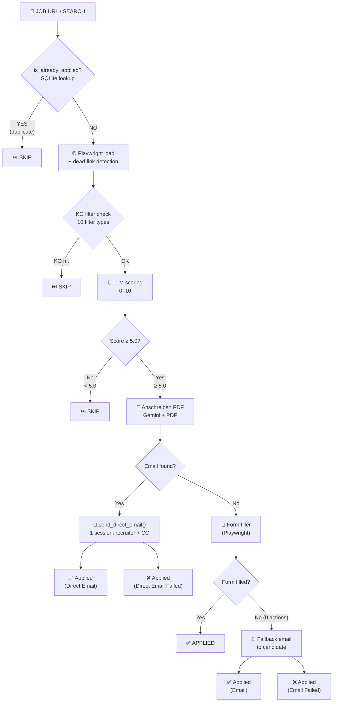

# Gemini-JobAgent

Automated job application agent for the German-speaking job market. Scrapes job portals (Indeed, LinkedIn, StepStone, Monster, ARGE), evaluates vacancies through LLM scoring, generates personalised cover letters as PDF, and submits applications via direct email or web form autofill with Playwright.

---

## 🚀 Open Source — Fork & Improve

**This project lives from the community!**  
Whether you are an experienced Python developer, an AI enthusiast, or just someone who wants to automate the job application process — **you are warmly invited to fork this repository, improve it, or extend it**.

My roadmap includes:
- ➕ **New job platforms** — StepStone, Xing, Monster, Glassdoor
- ➕ **New LLM providers** — Claude, local models via Ollama
- ➕ **Headless CI/CD integration** — fully automated pipeline
- ➕ **Docker containerization** — one-command setup
- ➕ **Web UI / Dashboard** — track applications visually

→ **Fork the repository**, create a Pull Request, or open an Issue.  
→ **Every contribution counts** — be it a new module, a bug fix, or better documentation.

---

## Table of Contents

- [How It Works](#how-it-works)
- [Pipeline Diagram](#pipeline-diagram)
- [Requirements](#requirements)
- [Installation](#installation)
- [Configuration](#configuration)
- [CLI Arguments](#cli-arguments)
- [Architecture](#architecture)

---

## How It Works

The agent processes job vacancies one by one through a deterministic pipeline. Each vacancy goes through the following stages:

**1. Job URL acquisition** — URLs come from either an Indeed/StepStone keyword search (`--search-jobs`) or a direct URL (`--url`). Indeed search pages are parsed for individual job links; each link is visited separately.

**2. Duplicate check** — Every URL is checked against the SQLite database (`output/applications.db`, table `applied_jobs`). If the URL already exists (regardless of status), the vacancy is skipped immediately. This guarantees idempotency across multiple runs.

**3. Playwright page load** — The job page is opened in a Chrome browser controlled by Playwright. The agent waits for `domcontentloaded` + 2 seconds, then extracts the page title and full body text. Dead links are detected early (404 pages, expired Indeed job search pages) to avoid wasting LLM quota.

**4. Rule-based extraction** — Company name and job title are extracted from the page title using URL-specific heuristics (LinkedIn: `title | Company | LinkedIn`; Indeed: `title - company - Indeed`; StepStone: `title - Company`). If rules fail, Gemini extracts the data.

**5. KO filter check** — The job text is checked against hard filters from `job_criteria.yaml`:

- **Forbidden titles**: Senior, Middle, Consultant, Helpdesk, Full Stack — blocked immediately.
- **Company blacklist**: Specific companies (e.g. Zukunftsmotor) are blocked.
- **Language requirements**: German below B1 or English below A2 triggers a KO.
- **Education**: Roles requiring a specific degree without IT relevance are blocked; `block_degree_only_roles` and `require_it_degree_strictly` flags control strictness.
- **Certifications**: If RHCSA/RHCE/CCNA are listed as mandatory and missing in the profile, KO.
- **Security clearances**: U.S. citizenship, Secret/Top Secret clearance keywords → KO.
- **Spam providers**: GFN, WBS, DAA, IU keywords → KO (internships still allowed via `allow_internship`).
- **Salary**: `min_annual_eur` threshold checked against any salary mentioned.
- **Datacenter/physical work**: If the role requires on-site datacenter work and it is forbidden → KO.
- **User rejection reasons**: Past user rejections (saved in `user_rejections` table) are merged into the KO list and passed to the scoring prompt, which gives 0/10 if the reason matches.

Any KO causes `score = 0` and the vacancy is logged as skipped.

**6. LLM scoring** — The job text and candidate profile are sent to Gemini (or OpenRouter fallback) with a scoring prompt. The LLM returns a score from 0.0 to 10.0, the reasoning text, and a match assessment.

If `score < min_score_to_apply` (default 5.0), the vacancy is logged as `Skipped (Low Score)` and skipped.

**7. Cover letter generation** — For vacancies scoring >= threshold, Gemini generates a personalised Anschreiben. The letter is rendered to a PDF file via ReportLab and saved to `output/Anschreiben_{CompanyName}.pdf`.

**8. Direct email** — The job description is scanned for a contact email (regex) and optionally a recruiter name (regex + Gemini `extract_recruiter_prompt`). If found:

- The Anschreiben is personalised with the recruiter's name.
- Relevant attachments are collected: the newest Lebenslauf (from `candidate_files` table), the generated Anschreiben PDF, and any Zertifikat/Diplom whose content keyword-overlaps with the job description.
- A single SMTP session is opened: the primary email is sent to the recruiter, then a CC copy (`[KOPIE]` prefix) is sent to the candidate in the same connection.
- On `SMTPServerDisconnected`, the agent reconnects and retries up to 3 times.
- On success → `Applied (Direct Email)`, `email_sent = 1`.
- On failure → `Applied (Direct Email Failed)`.

**9. Form filler** — If no contact email is found, Playwright attempts to fill the job application web form:

- Fields are matched by name/label/placeholder keywords (`name`, `vorname`, `nachname`, `email`, `telefon`, `strasse`, `plz`, `stadt`, `linkedin`, `github`, `gehaltsvorstellung`, `verfügbarkeit`, `kündigungsfrist`, `arbeitserlaubnis`, `nachricht`, `anschreiben`, `lebenslauf`, `upload`, `file`, `bewerbung`).
- File uploads are handled via `set_input_files`.
- Text inputs use `fill()` and `select_option()` for dropdowns.
- If the page is LinkedIn and the form filler produced 0 actions, `try_linkedin_easy_apply()` is triggered (clicks the "Easy Apply" button and steps through modal dialogs).

**10. Fallback email** — If the form filler produced 0 actions AND no recruiter email was found, the agent sends the generated Anschreiben + attachments to the candidate's own email address (from `candidate_profile.json`) as a fallback. This ensures the candidate never loses an application even when automation fails.

- Success → `Applied (Email)`, `email_sent = 1`.
- Failure → `Applied (Email Failed)` (retried later by `--send-email`).

**11. Human-in-the-loop (or auto-approve)** — For form-filled applications, the agent prints the score + reasoning and waits for user input unless `--auto-approve` is active:

- `enter` → application is logged as `Applied`.
- `cancel` → user is prompted for a reason, which is saved to `user_rejections` table AND appended to `ko_filters.user_rejected_reasons` in `job_criteria.yaml`. This creates a feedback loop — future runs will pass this reason to the scoring prompt, causing matching vacancies to score 0/10.
- `s` → skip to next vacancy.

**12. Batch email sending** — At the end of the run (or via `--send-email` standalone), `send_pending_emails()` queries the database for all records with `email_sent = 0`. For each:

- A ZIP archive is built containing `job_info.txt` (company, title, URL, date, score), `terminal_output.txt` (cleaned log), and the Anschreiben PDF.
- A single SMTP session connects and sends all pending ZIP packages to the candidate's email.
- On `SMTPServerDisconnected`, the remaining packages are skipped (logged, to be retried next run).
- `email_sent = 1` is set on success.

---

## Pipeline Diagram

The diagram below shows the current architecture for job portals **LinkedIn** and **Indeed**. As the project evolves and new platforms (StepStone, Xing, Monster, Glassdoor) are added, this pipeline may change or be extended.



## Requirements

### Python

- **Version**: 3.10 or higher (tested with 3.11, 3.12).
- **Architecture**: x64 recommended. ARM (Windows ARM) may have Playwright compatibility issues.

### SQLite

- **Bundled with Python**: No separate installation needed. SQLite is part of the Python standard library (`sqlite3` module).
- **Database file**: Created automatically at `output/applications.db` on first run.
- **Schema**: Two tables — `applied_jobs` (application history) and `user_rejections` (user-cancelled applications with reasons). Schema is auto-created by `init_db()`.

### Operating System

- **Cross-platform**: Runs on Windows, Linux, and macOS. Set `chrome_data_dir` in `config.yaml` to match your OS (see sample file for examples).
- **Windows**: Tested on Windows 11. Use `.\check_types.ps1` for type checking.
- **Linux**: Tested on Gentoo Linux. Use `bash check_types.sh` for type checking.
- **PowerShell**: Used for coloured terminal output on Windows. On Linux/macOS, ANSI escape codes work natively.

### Chrome / Chromium

- **Required for**: Playwright web scraping and form filling.
- **Installation options**:
  1. Existing Chrome installation (point `config.yaml` → `user_profile.chrome_data_dir` to your profile).
  2. Playwright's bundled Chromium (auto-downloaded by `playwright install chromium`).

### Disk Space

- **Minimum**: ~500 MB for Playwright Chromium browser.
- **Runtime**: ~50 MB for generated PDFs, ZIP archives, and the SQLite database.

---

## Installation

### 1. Install Python packages

```powershell
python -m pip install google-genai playwright pyyaml pymupdf reportlab
```

> **Note**: `reportlab` is required for PDF generation. `pymupdf` (fitz) is used for PDF text extraction during document indexing. If `pip install` is blocked by Windows Defender, use `python -m pip install` instead of bare `pip`.

### 2. Install Playwright Chromium

```powershell
python -m playwright install chromium
```

This downloads ~300 MB of browser binaries to `%USERPROFILE%\AppData\Local\ms-playwright`.

### 3. Verify installation

```powershell
python -c "import sqlite3; print('SQLite', sqlite3.sqlite_version); from google import genai; print('Gemini SDK OK'); import playwright; print('Playwright OK')"
```

### 4. Prepare your documents

After extracting the archive, your project should look like this:

```
Gemini-JobAgent/
├── README.md
├── .gitignore
├── requirements.txt
├── src/
│   ├── agent.py
│   ├── config/
│   │   ├── config.yaml.sample       ← rename to config.yaml
│   │   ├── job_criteria.yaml.sample
│   │   └── candidate_profile.json.sample
│   └── ...
└── documents/                       ← place your PDF files here
    └── .gitkeep
```

**Steps:**

1. **Create the `documents/` folder** (if not already present) — it is a sibling of `src/`.
2. **Copy your CV** into `documents/` — e.g. `documents/Lebenslauf_YourName.pdf`.
3. **Add certificates, diplomas, recommendation letters** — all PDFs in `documents/` will be automatically indexed by the agent (classified by filename and content).
4. **Rename the config files** — copy `src/config/config.yaml.sample` → `src/config/config.yaml`, and optionally customise `job_criteria.yaml.sample` and `candidate_profile.json.sample`.
5. **Edit `config.yaml`** — set `cv_path` and `documents_dir` to match your folder structure:

```yaml
user_profile:
  cv_path: "../documents/Lebenslauf_YourName.pdf"   # relative to src/
  documents_dir: "../documents"                      # relative to src/
```

> The paths are relative to the `src/` directory because `agent.py` runs from there. Absolute paths also work.

---

## Configuration

### API Keys

#### Gemini API Key (primary LLM)

| Item | Detail |
|------|--------|
| **Where to get** | https://aistudio.google.com/apikey |
| **Cost** | Free tier: 60 requests per minute, 1,500 requests per day on `gemini-2.5-flash` |
| **What it's used for** | Scoring jobs, generating cover letters, extracting recruiter names, classifying documents, parsing CVs |
| **How many** | Up to 5 keys in `config.yaml` → `gemini.api_keys`. The agent rotates through them automatically on 429/ResourceExhausted. Multiple keys extend your daily quota. |

#### OpenRouter API Key (free fallback LLM)

| Item | Detail |
|------|--------|
| **Where to get** | https://openrouter.ai/keys (sign up, create a free API key) |
| **Cost** | Free tier: 20 RPM, 50 RPD, multiple models (Llama 3, Mistral, Qwen, DeepSeek, Gemma) |
| **What it's used for** | Automatic fallback when ALL Gemini keys and models are exhausted |
| **How to set** | Set as environment variable: `$env:OPENROUTER_API_KEY="sk-or-v1-..."` or in system environment variables. **Do NOT** put it in `config.yaml`. |

#### SMTP / Google App Password

| Item | Detail |
|------|--------|
| **Where to get** | https://myaccount.google.com/apppasswords |
| **Prerequisites** | Google Account with 2-Factor Authentication enabled |
| **What it's used for** | Sending application emails (direct email to recruiter, CC copy to candidate, pending batch emails) |
| **How to generate** | Go to App Passwords → Select app "Mail" → Select device "Windows Computer" → Copy the 16-character password |
| **SMTP settings** | Host: `smtp.gmail.com`, Port: `587` (STARTTLS, fallback to 465 SSL), Username: your full Gmail address, Password: the 16-char App Password |
| **Security** | The App Password grants email-only access. It can be revoked at any time from the same page. Never use your regular Gmail password. |

#### DeepSeek API Key (optional, experimental)

| Item | Detail |
|------|--------|
| **Where to get** | https://platform.deepseek.com/api_keys |
| **Cost** | Paid (requires account balance top-up). Free credits on registration. |
| **Usage** | Experimental module `job_agent/deepseek_llm.py`. Not used unless explicitly configured. |

### Configuration Files

All configuration files are in `config/`. Sample files (with `.sample` extension) serve as templates. On first run, if an active config file is missing, the agent automatically copies the `.sample` file and prints a warning.

#### `config/config.yaml` — Master configuration

```yaml
gemini:
  model: gemini-2.5-flash
  api_keys:
    - "YOUR_API_KEY_1"
    - "YOUR_API_KEY_2"

user_profile:
  chrome_data_dir: "C:\\Users\\YourName\\AppData\\Local\\Google\\Chrome\\User Data"
  chrome_profile: Default
  cv_path: "Lebenslauf_YourName.pdf"
  documents_dir: "documents"

smtp:
  host: smtp.gmail.com
  port: 587
  username: "your.email@gmail.com"
  password: "xxxx xxxx xxxx xxxx"   # Google App Password

defaults:
  availability: "zwei Monate nach Zusage"
  notice_period: "3 Monate zum Quartalsende"
  salary_expectation: "36.000 €"
  work_permit: Germany

criteria:
  excluded_companies: ["CompanyToSkip"]
  german_level: B2
  min_salary_eur: 36000
  min_score: 8.0
  remote_allowed: true

llm:
  priority: gemini   # "gemini" or "openrouter" — which LLM to try first
```

> **Security**: This file contains API keys and SMTP password. It is listed in `.gitignore` and must NEVER be committed.

#### `config/candidate_profile.json` — Your professional profile

```json
{
  "personal_info": {
    "first_name": "Max",
    "last_name": "Mustermann",
    "email": "max.mustermann@gmail.com",
    "phone": "+49 176 12345678",
    "address": "Musterstr. 1, 12345 Berlin",
    "linkedin": "https://linkedin.com/in/maxmustermann",
    "github": "https://github.com/maxmustermann",
    "birth_date": "1990-01-01",
    "nationality": "Deutsch"
  },
  "education": [...],
  "experience": [...],
  "skills": ["Linux", "Python", "Java"],
  "certifications": [...],
  "languages": {"Deutsch": "C2", "Englisch": "B2", "Russisch": "Muttersprache"},
  "salary_expectation": "36.000 €",
  "availability": "zwei Monate nach Zusage",
  "notice_period": "3 Monate zum Quartalsende",
  "work_permit": "Germany",
  "career_start_year": 2010
}
```

#### `config/job_criteria.yaml` — KO filters and scoring rules

Defines `ko_filters` (blocking criteria), `scoring` (minimum score), and `cover_letter` (mandatory skills to mention). See the sample file for the full schema.

#### `config/prompts.yaml` — LLM prompt templates

Customise prompts for:
- `scoring_prompt` — how the LLM evaluates job fit
- `cover_letter_prompt` — how the Anschreiben is written
- `form_filler_prompt` — how Playwright fills web form fields
- `classification_prompt` — how documents are classified
- `extract_recruiter_prompt` — how recruiter names are extracted from job text

**Important**: The `form_filler_prompt` must return a JSON array of `{action, selector_type, selector_value, value}`. This format is critical for Playwright to parse and execute form actions.

---

## CLI Arguments

### Overview

```powershell
python agent.py [--search-jobs QUERY] [--location CITY] [--radius KM]
                [--url URL] [--interactive] [--headless] [--auto-approve]
                [--send-email] [--parse-cv] [--test-score FILE]
                [--test-anschreiben COMPANY FILE] [--generate-dummy-cv]
                [--reset-candidate]
```

### Argument Reference

#### `--search-jobs [QUERY]`

Searches Indeed for job vacancies matching the keyword, scrapes all result pages, and processes each link through the full pipeline.

| Aspect | Detail |
|--------|--------|
| **Syntax** | `--search-jobs "Junior Systemadministrator"` or `--search-jobs ""` (empty = any job) |
| **Works with** | `--location`, `--radius`, `--headless`, `--auto-approve`, `--send-email` |
| **Conflicts with** | `--url`, `--interactive`, `--parse-cv`, `--test-score`, `--test-anschreiben`, `--generate-dummy-cv`, `--reset-candidate` |
| **Behaviour** | Opens Indeed → types query → clicks search → extracts all job links from result pages → visits each link → runs full pipeline |
| **Note** | The `nargs="?"` allows omitting the value: `--search-jobs` with no argument searches for any job. |

#### `--location CITY`

City or region to search in. Used together with `--search-jobs`.

| Aspect | Detail |
|--------|--------|
| **Syntax** | `--location "Frankfurt am Main"` |
| **Requires** | `--search-jobs` |
| **Conflicts with** | `--url`, `--interactive`, `--parse-cv`, `--test-score`, `--test-anschreiben`, `--generate-dummy-cv`, `--reset-candidate` |
| **Default** | If omitted, Indeed searches without location filter. |

#### `--radius KM`

Search radius around the location.

| Aspect | Detail |
|--------|--------|
| **Syntax** | `--radius 25` |
| **Requires** | `--search-jobs` + `--location` |
| **Conflicts with** | Same as `--location` |

#### `--url URL`

Process a single job vacancy by URL.

| Aspect | Detail |
|--------|--------|
| **Syntax** | `--url "https://de.indeed.com/viewjob?jk=XXXXX"` |
| **Works with** | `--headless`, `--auto-approve`, `--send-email` |
| **Conflicts with** | `--search-jobs`, `--interactive`, `--parse-cv`, `--test-score`, `--test-anschreiben`, `--generate-dummy-cv`, `--reset-candidate` |
| **Supports** | Indeed, LinkedIn, StepStone, Monster, and any other job board (Playwright loads the page regardless of source) |
| **Note** | The URL is processed through the full pipeline from step 2 onwards (no search step). |

#### `--interactive`

Prompts the user to paste a URL interactively.

| Aspect | Detail |
|--------|--------|
| **Syntax** | `--interactive` |
| **Works with** | `--headless`, `--auto-approve`, `--send-email` |
| **Conflicts with** | `--search-jobs`, `--url`, `--parse-cv`, `--test-score`, `--test-anschreiben`, `--generate-dummy-cv`, `--reset-candidate` |
| **Behaviour** | Prints `Paste the job URL and press Enter:` → waits for input → processes the URL through the full pipeline → loops asking for the next URL (type `exit` to stop) |

#### `--headless`

Runs Chrome in headless mode (no visible browser window). Automatically enables `--auto-approve`.

| Aspect | Detail |
|--------|--------|
| **Syntax** | `--headless` |
| **Works with** | `--search-jobs`, `--url`, `--interactive`, `--send-email` |
| **Conflicts with** | `--parse-cv`, `--test-score`, `--test-anschreiben`, `--generate-dummy-cv`, `--reset-candidate` |
| **Behaviour** | Launches a separate Chrome instance with a `_Debug` profile on port 9222. The user's main Chrome stays open (required for pre-authenticated sessions on LinkedIn, captcha handling, etc.). The `--headless` flag implies `--auto-approve` (no GUI, no interactive prompts). |
| **Note** | Headless Chrome has limited support for some web features. If a job page renders differently in headless mode, the form filler may behave differently. |

#### `--auto-approve`

Automatically logs all applications without waiting for user confirmation.

| Aspect | Detail |
|--------|--------|
| **Syntax** | `--auto-approve` |
| **Works with** | `--search-jobs`, `--url`, `--interactive`, `--send-email` |
| **Conflicts with** | `--parse-cv`, `--test-score`, `--test-anschreiben`, `--generate-dummy-cv`, `--reset-candidate` |
| **Behaviour** | The human-in-the-loop step is skipped — the application is logged as `Applied` automatically. This flag also implies `--send-email` (pending emails are sent automatically at the end of the pipeline). |
| **Note** | Use carefully — applications are submitted without review. The score and reasoning are still printed to the console for audit. |

#### `--send-email`

Sends all pending application emails to the candidate.

| Aspect | Detail |
|--------|--------|
| **Syntax** | `--send-email` (standalone) or with other flags |
| **Works with** | `--search-jobs`, `--url`, `--interactive`, `--auto-approve` |
| **Conflicts with** | `--parse-cv`, `--test-score`, `--test-anschreiben`, `--generate-dummy-cv`, `--reset-candidate` |
| **Behaviour** | Queries `applied_jobs` for records with `email_sent = 0`, builds ZIP packages, connects SMTP once, sends all pending emails in a single session. When used standalone (without `--url`/`--interactive`/`--search-jobs`), the agent does NOT start Playwright. |
| **Note** | Anschreiben PDFs are included in the ZIP only if they exist on disk (generated during a previous pipeline run). |

#### `--parse-cv`

Parses and indexes the candidate's CV PDF without running the job pipeline.

| Aspect | Detail |
|--------|--------|
| **Syntax** | `--parse-cv` |
| **Works with** | Nothing (standalone only) |
| **Conflicts with** | Everything else |
| **Behaviour** | Opens the PDF specified in `config.yaml` → `user_profile.cv_path`, extracts text via PyMuPDF, sends it to Gemini for parsing (acts as a Senior HR specialist — extracts skills, experience, education, seniority level, and target job directions), and updates the `candidate_profile.json` with the parsed data. Also indexes all PDFs in `documents/` directory into the `candidate_files` table. |

#### `--test-score FILE`

Tests the scoring prompt on a job description text file.

| Aspect | Detail |
|--------|--------|
| **Syntax** | `--test-score job_test.txt` |
| **Works with** | Nothing (standalone only) |
| **Conflicts with** | Everything else |
| **Behaviour** | Reads the file, sends it to Gemini with the scoring prompt, prints the raw LLM response. Useful for prompt engineering and debugging scoring criteria. |

#### `--test-anschreiben COMPANY FILE`

Tests the cover letter generation for a given company and job description.

| Aspect | Detail |
|--------|--------|
| **Syntax** | `--test-anschreiben "Muster GmbH" job_test.txt` |
| **Works with** | Nothing (standalone only) |
| **Conflicts with** | Everything else |
| **Behaviour** | Reads the file, sends it to Gemini with the cover letter prompt (with the company name), prints and optionally saves the generated Anschreiben. |

#### `--generate-dummy-cv`

Generates a dummy CV PDF for testing purposes.

| Aspect | Detail |
|--------|--------|
| **Syntax** | `--generate-dummy-cv` |
| **Works with** | Nothing (standalone only) |
| **Conflicts with** | Everything else |
| **Behaviour** | Creates a CV PDF with placeholder data (fictional person) at `output/dummy_cv.pdf`. Useful for testing the pipeline without sharing real personal data. |

#### `--reset-candidate`

Destructive reset of all candidate data.

| Aspect | Detail |
|--------|--------|
| **Syntax** | `--reset-candidate` |
| **Works with** | Nothing (standalone only) |
| **Conflicts with** | Everything else |
| **Behaviour** | 1. Creates a git commit `RESTORE` (snapshot of current state). 2. Deletes SQLite database (`output/applications.db`). 3. Deletes all generated PDFs in `output/`. 4. Copies `.sample` files over active configs (resets to templates). 5. Clears `candidate_files` table. Use when you want to start fresh. |

### Compatibility Matrix

| Argument | search-jobs | location | radius | url | interactive | headless | auto-approve | send-email | parse-cv | test-score | test-anschreiben | generate-dummy-cv | reset-candidate |
|---|---|---|---|---|---|---|---|---|---|---|---|---|---|
| `--search-jobs` | — | ✅ | ✅ | ❌ | ❌ | ✅ | ✅ | ✅ | ❌ | ❌ | ❌ | ❌ | ❌ |
| `--location` | ✅ | — | ✅ | ❌ | ❌ | ✅ | ✅ | ✅ | ❌ | ❌ | ❌ | ❌ | ❌ |
| `--radius` | ✅ | ✅ | — | ❌ | ❌ | ✅ | ✅ | ✅ | ❌ | ❌ | ❌ | ❌ | ❌ |
| `--url` | ❌ | ❌ | ❌ | — | ❌ | ✅ | ✅ | ✅ | ❌ | ❌ | ❌ | ❌ | ❌ |
| `--interactive` | ❌ | ❌ | ❌ | ❌ | — | ✅ | ✅ | ✅ | ❌ | ❌ | ❌ | ❌ | ❌ |
| `--headless` | ✅ | ✅ | ✅ | ✅ | ✅ | — | ✅* | ✅ | ❌ | ❌ | ❌ | ❌ | ❌ |
| `--auto-approve` | ✅ | ✅ | ✅ | ✅ | ✅ | ✅* | — | ✅* | ❌ | ❌ | ❌ | ❌ | ❌ |
| `--send-email` | ✅ | ✅ | ✅ | ✅ | ✅ | ✅ | ✅* | —** | ❌ | ❌ | ❌ | ❌ | ❌ |
| `--parse-cv` | ❌ | ❌ | ❌ | ❌ | ❌ | ❌ | ❌ | ❌ | — | ❌ | ❌ | ❌ | ❌ |
| `--test-score` | ❌ | ❌ | ❌ | ❌ | ❌ | ❌ | ❌ | ❌ | ❌ | — | ❌ | ❌ | ❌ |
| `--test-anschreiben` | ❌ | ❌ | ❌ | ❌ | ❌ | ❌ | ❌ | ❌ | ❌ | ❌ | — | ❌ | ❌ |
| `--generate-dummy-cv` | ❌ | ❌ | ❌ | ❌ | ❌ | ❌ | ❌ | ❌ | ❌ | ❌ | ❌ | — | ❌ |
| `--reset-candidate` | ❌ | ❌ | ❌ | ❌ | ❌ | ❌ | ❌ | ❌ | ❌ | ❌ | ❌ | ❌ | — |

- ✅ = compatible
- ❌ = mutually exclusive (passing both causes the last one to win or raises an error)
- ✅* = automatically enabled by the other flag
- —** = `--send-email` standalone (no URL/search) skips Playwright entirely

### Argument Families

The CLI arguments naturally group into three mutually exclusive families:

| Family | Arguments | Purpose |
|--------|-----------|---------|
| **Job acquisition** | `--search-jobs`, `--location`, `--radius` | Indeed keyword search |
| **Single job** | `--url`, `--interactive` | Process one or more URLs manually |
| **Utilities** | `--parse-cv`, `--test-score`, `--test-anschreiben`, `--generate-dummy-cv`, `--reset-candidate` | Standalone tools |

Within the job acquisition family, you can add:
- `--headless` (invisible browser)
- `--auto-approve` (skip human review)
- `--send-email` (send pending emails after processing)

### Common Usage Examples

```powershell
# Standard workflow: search + GUI + human review
python agent.py --search-jobs "Junior Systemadministrator" --location "Frankfurt am Main" --radius 25

# Headless automation
python agent.py --search-jobs "Junior Linux" --location "Frankfurt" --radius 25 --headless

# Single manual URL with auto-approve
python agent.py --url "https://de.indeed.com/viewjob?jk=XXXXX" --auto-approve

# Interactive loop
python agent.py --interactive

# Just send pending emails (no scraping)
python agent.py --send-email

# Parse CV only
python agent.py --parse-cv

# Test scoring prompt
python agent.py --test-score job_test.txt

# Full reset
python agent.py --reset-candidate
```

---

## Architecture

### Module Overview

```
agent.py                          # CLI entry point, argparse, Tkinter GUI, main pipeline loop
│
├── job_agent/config.py           # YAML/JSON config loaders, restore from .sample
├── job_agent/db.py               # SQLite init, queries, logging
├── job_agent/llm.py              # Gemini SDK, key rotation, model fallback, OpenRouter dispatch
├── job_agent/utils.py            # ANSI colours, JSON repair, ANSI escape removal, profile normalisation
├── job_agent/direct_email_applier.py  # SMTP email sending with reconnect, contact extraction
├── job_agent/email_sender.py     # Batch email sender (pending jobs → ZIP → SMTP)
├── job_agent/openrouter_llm.py   # OpenRouter API client (free LLM fallback)
├── job_agent/groq_llm.py         # Groq API client (region-blocked fallback)
├── job_agent/deepseek_llm.py     # DeepSeek API client (experimental)
└── job_agent/__init__.py         # Package marker
```

### LLM Routing

```
llm_request_with_fallback(prompt)
  │
  ├── priority == "openrouter" ? → call_openrouter() → success? → return
  │
  └── loop over models [gemini-2.5-flash, gemini-3.1-flash-lite, ...]
        │
        └── loop over API keys (up to 5)
              │
              ├── key exhausted (429) → mark exhausted → next key
              ├── all keys exhausted → next model
              └── all models exhausted → OpenRouter fallback
                    │
                    ├── OpenRouter success → return
                    └── OpenRouter fails → interactive user prompt:
                          [1] Enter new API key → retry
                          [2] Wait 1 hour → reset all keys → retry
                          [3] Exit
```

### Database Schema

```sql
-- Main application log
applied_jobs (
    id              INTEGER PRIMARY KEY AUTOINCREMENT,
    company_name    TEXT,
    job_title       TEXT,
    url             TEXT UNIQUE,
    score           REAL,
    applied_date    TEXT,
    status          TEXT,     -- 'Applied' | 'Self-rejection' | 'Skipped (Low Score)'
    email_sent      INTEGER DEFAULT 0,
    terminal_output TEXT,
    pdf_path        TEXT
)

-- User-initiated rejections (feedback loop)
user_rejections (
    id              INTEGER PRIMARY KEY AUTOINCREMENT,
    company_name    TEXT,
    job_title       TEXT,
    url             TEXT UNIQUE,
    reason          TEXT,
    date            TEXT
)

-- Candidate document index
candidate_files (
    id              INTEGER PRIMARY KEY AUTOINCREMENT,
    file_path       TEXT UNIQUE,
    file_size       INTEGER,
    mtime           REAL,
    classification  TEXT,     -- 'Lebenslauf' | 'Anschreiben' | 'Zertifikat' | 'Diplom' | 'Sonstiges'
    parsed_json     TEXT
)
```

### PDF → SQLite Document Pipeline

1. **Filename keywords** (instant, free): `lebenslauf/cv/curriculum → Lebenslauf`, `anschreiben/cover_letter → Anschreiben`, `zertifikat/certificate → Zertifikat`, `diplom/zeugnis/degree → Diplom`.
2. **Text keywords** (instant, free via PyMuPDF): `werdegang/berufserfahrung → Lebenslauf`, `sehr geehrte/bewerbung um → Anschreiben`.
3. **Gemini API** (only if both above fail): Send first 1000 chars to the classification prompt.
4. **Gemini CV parsing** (only for Lebenslauf): Full document sent to Gemini acting as Senior HR specialist → returns structured JSON with `seniority_level`, `hr_assessment`, `job_search_directions`, `target_vacancies`.

---

## Security

**Files that must NEVER be committed to git:**

| Category | Files | Reason |
|----------|-------|--------|
| PDF | `*.pdf`, `output/*.pdf` | CV, certificates, cover letters contain full name, address, email, phone |
| Database | `output/*.db` | Application history with company names, job titles, terminal output |
| Config | `config.yaml` | Gemini API keys (up to 5), SMTP password, Chrome profile paths |
| Profile | `candidate_profile.json` | Full candidate profile: name, address, contacts, skills, education |
| Environment | `.env` | Environment variables with API keys |
| Screenshots | `output/*.png`, `output/*.jpg` | Playwright session captures may contain personal data |
| HTML | `output/*.html` | Scraped job pages may contain personal data |
| ZIP | `output/*.zip` | Archives containing PDFs and application metadata |

**Pre-commit enforcement:**
- `check_secrets.py` scans all staged files before every commit (run via `pre-commit` hook if configured).
- `git add -A` is prohibited — only specific files may be staged.
- Committable file types: `*.py`, `*.yaml`, `*.yaml.sample`, `*.json.sample`, `*.md`, `*.txt`, `.gitignore`, `requirements.txt`.

---

## Troubleshooting

| Problem | Solution |
|---------|----------|
| `pip install` blocked by Windows Defender | Use `python -m pip install` instead of bare `pip` |
| `SMTP disconnected while sending primary: Server not connected` | Gmail may rate-limit your IP during heavy pipeline scraping (Playwright + LLM calls from the same IP). The agent retries with reconnect up to 3 times. If all fail, the application is logged as `Applied (Direct Email Failed)` and `--send-email` at the end of the pipeline will deliver the ZIP package to the candidate reliably (after the IP becomes idle). This is expected behaviour — direct email mid-pipeline is best-effort, batch email post-pipeline is the reliable fallback. |
| `[Gemini API] All keys exhausted for model ...` | All configured API keys have hit their rate limits. The agent falls back to OpenRouter. If OpenRouter also fails, the agent prompts for a new key or to wait 1 hour. |
| Chrome says `User Data Directory is already in use` | Close all Chrome windows, or use `--headless` which starts a separate Chrome instance with a debug profile. |
| `--search-jobs` returns no results | Indeed may block automated searches. Try running with `--headless` (uses a different Chrome profile). Also check that your Chrome profile is logged into Indeed. |
| LinkedIn Easy Apply not working | LinkedIn requires an active login session. Log into LinkedIn in your Chrome profile before running the agent. In headless mode, log into LinkedIn using the `_Debug` profile first. |
| `playwright install chromium` fails | Ensure you have administrative privileges. On Windows, run PowerShell as Administrator. |
